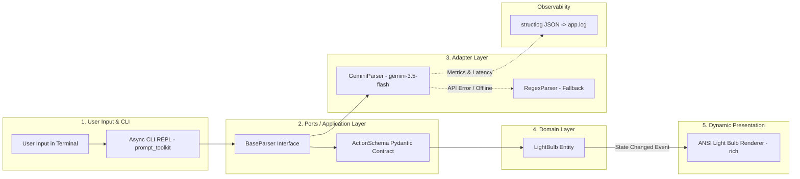

# 💡 AI Smart Light Bulb Controller

[](https://github.com/shin7965977/light/actions)
[](https://www.python.org/)
[](https://ai.google.dev/)
[](https://www.docker.com/)
[-brightgreen.svg)](https://pytest.org/)
[](https://github.com/astral-sh/ruff)
[](https://mypy-lang.org/)

An enterprise-grade, asynchronous Natural Language Controller for a Virtual Smart Light Bulb, built with **Clean Architecture**, **Google Gemini 3.5 Flash**, **Interactive Disambiguation**, **Offline Regex Fallback**, and dynamic **TrueColor ANSI ASCII Terminal Graphics**.

---

## 🎯 Challenge Requirements & Solutions

This project is built to fulfill and exceed all specifications outlined in the **Light Bulb Challenge**:

### 1. Part 1: On & Off (`turn_on()`, `turn_off()`)
* **Requirement**: Control basic power states and compound linguistic negations.
  * `"Please turn the light on"` ➔ `Light Bulb switched ON`
  * `"Now please turn it off"` ➔ `Light Bulb switched OFF`
  * `"Switch it back on instead of off"` ➔ `Light Bulb switched ON`
* **How I Solved It**:
  * **Gemini 3.5 Flash Semantic Parser**: Ingests the full natural language sentence and resolves compound negations (e.g. distinguishing intent from contrastive clauses).
  * **Deterministic Regex Fallback**: Employs lookahead/compound regex pattern matching to ensure offline resilience for compound phrases.

### 2. Part 2 (Bonus): Set Brightness (`set_brightness()`)
* **Requirement**: Support absolute brightness adjustments.
  * `"Please set the brightness to 70%"` ➔ `Light Bulb brightness set to 70%`
  * `"Now set it to 10% instead of 70%"` ➔ `Light Bulb brightness set to 10%`
* **How I Solved It**:
  * **Pydantic Structured Action Contract**: Normalizes percentages into strict `float` values bounded between `0.0` and `1.0`.

### 3. Advanced Context-Aware Commands (Bonus & Notes)
* **Requirement**: Support stateful and relative commands.
  * `"Toggle the light"`: Inverts state based on current bulb power status (`is_on`).
  * `"Reduce the brightness by 20%"`: Performs relative arithmetic calculation (`current_brightness - 0.20`).
* **How I Solved It**:
  * **Dynamic State Context Injection**: Every parsing request injects a `BulbContext(is_on, brightness)` snapshot, enabling both the LLM and Regex engine to perform precise relative math and state inversion.

### 4. Interactive Disambiguation & Clarification (Beyond Requirements)
* **Feature**: When an input is ambiguous, incomplete (e.g. `"20%"`, `"light"`, `"turn"`), or contains typos:
  * The system **interactively clarifies** user intent with tailored questions and selectable options `[1]`, `[2]`, `[3]`.

---

## 🏗️ Architecture & Engineering Highlights



* **Clean Architecture**: 4 strictly decoupled layers (Domain, Ports, Adapters, Interface) adhering to SOLID principles and Dependency Inversion.
* **Dual-Engine Resilience**: Gemini 3.5 Flash primary semantic parser with instant, graceful degradation to a local Regex rule engine.
* **Ephemeral In-Memory Security**: API keys are prompted interactively and retained strictly in-memory during the session (never persisted to disk without consent).
* **Rich TrueColor Terminal Visualization**: 4-tiered high-contrast color palette (Off ➔ Dim Amber ➔ Warm Yellow ➔ White Hot) with dynamic ASCII filament rendering.
* **Observability**: Asynchronous structured logging (`structlog`) writing latency metrics and token events to `app.log`.

---

## 🚀 Quick Start Guide

### Option 1: Run with Docker (Recommended)

Ensure Docker Desktop is running, then run:

```bash
docker compose run --build app
```

*When prompted for `Gemini API Key`, paste your key or press **Enter** to run in offline Regex mode.*

---

### Option 2: Run Locally with Python

```bash
# 1. Clone repository
git clone https://github.com/shin7965977/light.git
cd light

# 2. Install dependencies
pip install -r requirements.txt

# 3. Launch application
python main.py
```

---

## 🧪 Testing & Code Quality

The codebase includes **18 deterministic automated unit and integration tests** covering state transitions, LLM mocking, regex rules, relative math, and interactive clarification.

```bash
# Run test suite
pytest -v

# Run linter
ruff check .

# Run strict type checking
mypy src tests light_bulb.py --ignore-missing-imports
```

---

## 📂 Project Structure

```
.
├── light_bulb.py                # Core Domain Entity (Given class)
├── main.py                      # Application Entry Point
├── Dockerfile                   # Multi-stage lightweight Linux container
├── docker-compose.yml           # Container orchestration configuration
├── requirements.txt             # Project dependencies
├── pytest.ini                   # Pytest configuration
├── SOLUTION.md                  # Comprehensive Double Diamond design journey & architecture deep dive
├── SPEC.md                      # Formal Functional & Technical Specification
├── .github/workflows/ci.yml     # Automated CI pipeline (Ruff, Mypy, Pytest)
├── src/
│   ├── config.py                # Ephemeral session configuration & auth
│   ├── observability.py         # Structured JSON logging (structlog)
│   ├── ports/
│   │   ├── action_schema.py     # Pydantic schemas (ActionSchema, ActionType, BulbContext)
│   │   └── base_parser.py       # Abstract BaseParser interface
│   ├── adapters/
│   │   ├── gemini_parser.py     # Gemini 3.5 Flash semantic parser
│   │   └── regex_parser.py      # Local regex fallback & disambiguation engine
│   └── interface/
│       ├── ansi_bulb.py         # TrueColor dynamic ANSI ASCII renderer
│       └── repl.py              # Async non-blocking CLI REPL (prompt_toolkit)
└── tests/
    ├── test_light_bulb.py       # Unit tests for domain entity
    ├── test_regex_parser.py     # Unit tests for regex & disambiguation
    ├── test_gemini_parser.py    # Unit tests for Gemini mock & fallback
    └── test_e2e_orchestrator.py # End-to-end integration tests
```

---

## 📖 In-Depth Design & Architectural Decisions

For a complete breakdown of our **Double Diamond (Discover, Define, Develop, Deliver)** design process, architectural decisions, and testing seams, please refer to:
👉 **[`SOLUTION.md`](./SOLUTION.md)**
