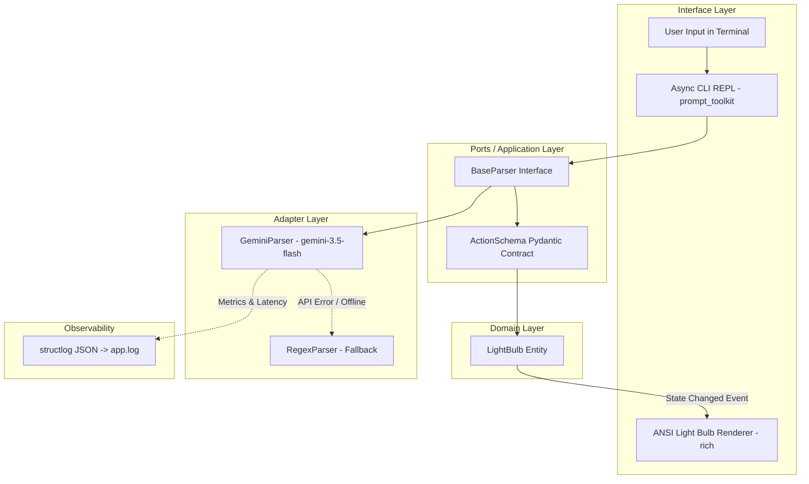

# Smart Light Bulb Solution & Architecture Document

This document outlines the design, architecture, and implementation of the **Natural Language Smart Light Bulb CLI**, developed using the **Double Diamond (Discover, Define, Develop, Deliver)** design framework and **Clean Architecture** principles.

---

## 💎 Double Diamond Engineering Journey

```
       DISCOVER               DEFINE                DEVELOP                DELIVER
  /───────────────\     /───────────────\     /───────────────\     /───────────────\
 /  Explore Edge   \   / Clean Arch &    \   /  Gemini 3.5 &   \   / Docker, CI/CD,  \
<   Cases & User    > <  Action Schema    > <   Regex Fallback  > <   Structured Log  >
 \  Constraints    /   \ Specifications  /   \  & Async REPL   /   \  & SOLUTION.md  /
  \───────────────/     \───────────────/     \───────────────/     \───────────────/
```

### 1. Discover (發散探索)
- **Constraint Identification**: The original `LightBulb` class maintained internal state (`is_on`, `brightness`) and directly printed status messages to stdout.
- **Linguistic Ambiguity & Context Dependency**:
  - *Absolute commands*: `"Turn on"`, `"Set brightness to 70%"`.
  - *Context-dependent relative commands*: `"Toggle the light"` (requires `is_on` state), `"Dim by 20%"` (requires `brightness` context).
  - *Compound / Semantic negation*: `"Switch it back on instead of off"`.
  - *Invalid / Out-of-domain inputs*: `"What's the weather today?"`.
- **Environment & DX**: Users need a zero-friction onboarding experience where API keys are automatically saved to `.env`, but testing can also run completely offline.

### 2. Define (收斂定義)
- **Layered Clean Architecture**: Strict decoupling into **Domain**, **Ports / Application**, **Adapters**, and **Interface** layers.
- **Structured Action Contract**: Pydantic-based `ActionSchema` with typed `ActionType` (`TURN_ON`, `TURN_OFF`, `SET_BRIGHTNESS`, `UNKNOWN`) and normalized float constraints (`0.0 <= value <= 1.0`).
- **Context Injection**: State snapshot (`is_on`, `brightness`) is dynamically injected into parser prompts.

### 3. Develop (發散實作)
- **Gemini 3.5 Flash Primary Parser**: Direct native integration with Google's latest `google-genai` SDK utilizing Structured Outputs (`response_schema=ActionSchema`).
- **Regex Fallback & Offline Resilience**: Local regex rule engine ensuring graceful degradation if the network drops or API quota is exhausted.
- **Async Interactive CLI**: Powered by `asyncio`, `prompt_toolkit` (for non-blocking asynchronous user input), and `rich` (for dynamic ANSI ASCII light bulb graphics).
- **Comprehensive Test Suite**: Fast, deterministic unit tests with `unittest.mock` to verify state transitions and parser logic in sub-second times without requiring real network calls.

### 4. Deliver (收斂交付)
- **Multi-Stage Dockerization**: Minimalist `Dockerfile` and `docker-compose.yml` for isolated container execution.
- **Automated CI/CD Pipeline**: GitHub Actions (`.github/workflows/ci.yml`) enforcing code style (`ruff`), type correctness (`mypy`), and test passing (`pytest`).
- **Background Observability**: Non-intrusive structured logging with `structlog` outputting latency and token usage to `app.log`.

---

## 🏗️ System Architecture & Data Flow



---

## 🚀 Getting Started

### 1. Local Installation

```bash
# Clone the repository
git clone https://github.com/shin7965977/light.git
cd light

# Install dependencies
pip install -r requirements.txt
```

### 2. Running the Application

```bash
python main.py
```

*On your first run, if `GEMINI_API_KEY` is not present, the CLI will prompt you to enter it and will automatically save it to `.env` for future sessions.*

### 3. Running with Docker

```bash
# Using Docker Compose
docker compose run app

# Or building directly
docker build -t smart-light-bulb .
docker run -it -e GEMINI_API_KEY="your-api-key" smart-light-bulb
```

---

## 🧪 Testing & Code Quality

### Run Unit Tests
```bash
pytest -v
```

### Run Linter & Type Checker
```bash
ruff check .
mypy src tests light_bulb.py --ignore-missing-imports
```

---

## 💡 Example Command Interactions

| Command | Category | System Behavior |
| :--- | :--- | :--- |
| `"Please turn the light on"` | Absolute Power | Switches light ON, bulb changes to bright yellow |
| `"Now please turn it off"` | Absolute Power | Switches light OFF, bulb dims to dark gray |
| `"Toggle the light"` | State-Dependent | Reverses current state based on context |
| `"Please set the brightness to 70%"` | Absolute Brightness | Sets brightness to 0.70, renders 70% intensity bar |
| `"Reduce the brightness by 20%"` | Relative Calculation | Calculates `0.70 - 0.20 = 0.50`, updates to 50% |
| `"Switch it back on instead of off"` | Compound / Negation | Resolves negation intent and powers bulb ON |
| `"What is the weather today?"` | Out-of-domain / Invalid | Gracefully responds with helpful prompt without crashing |
